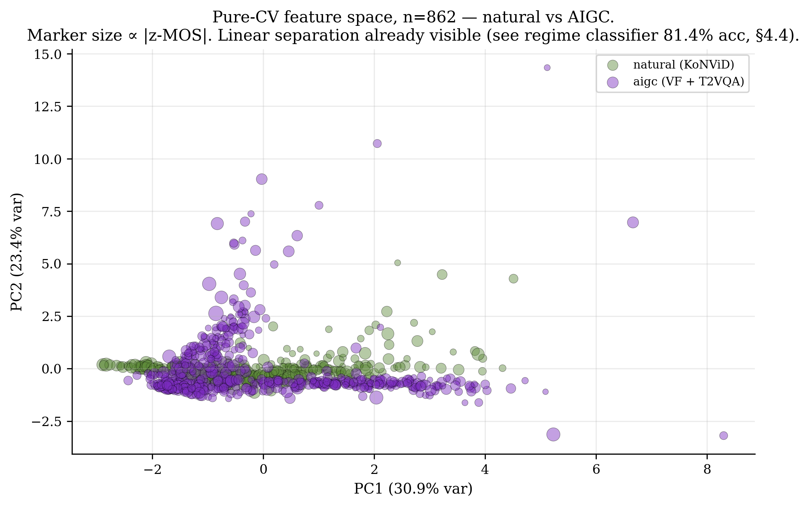
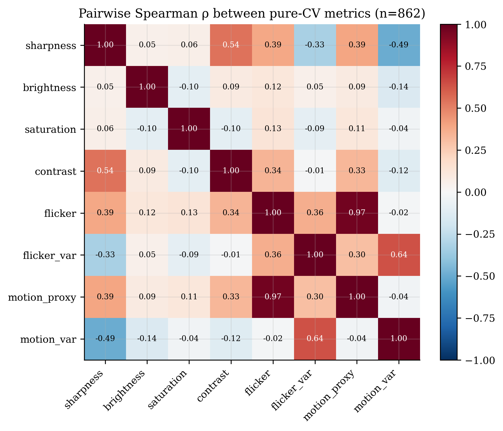
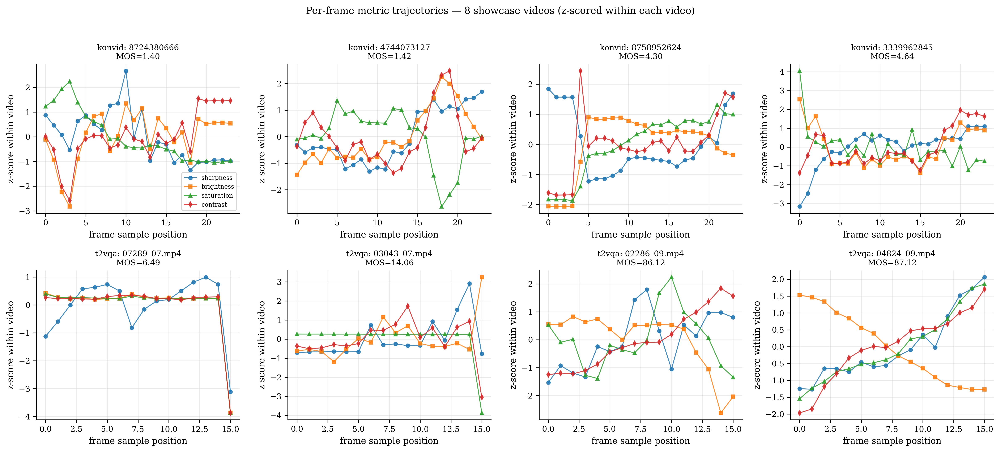
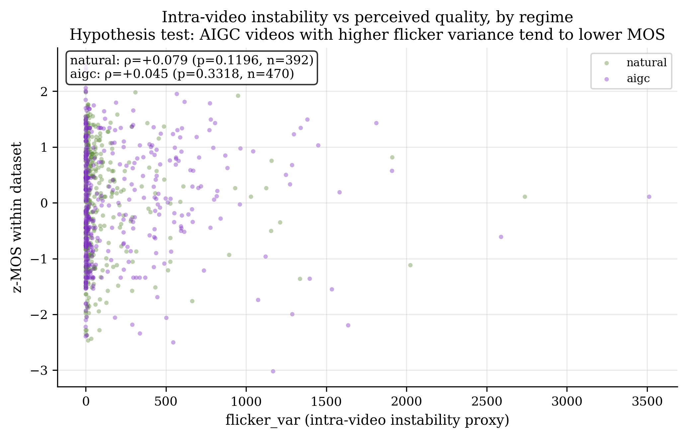
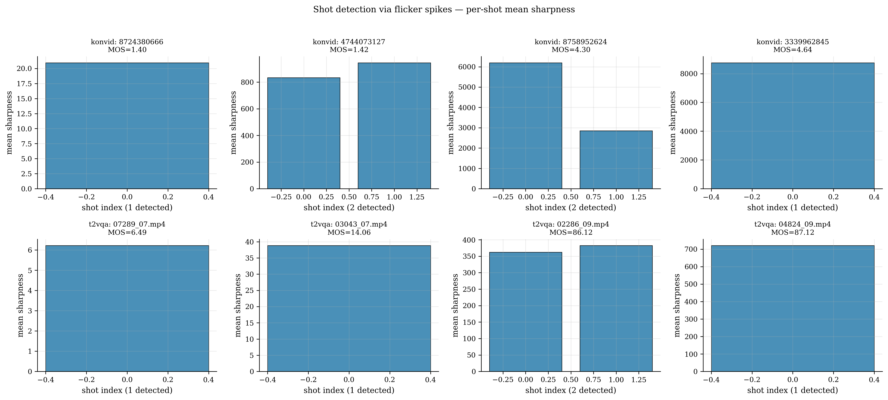

# CineInfini Video Comparison Report — v0.4.10.0

**Date:** 2026-04-28  · **Author:** Salah-Eddine BENBRAHIM  · **n = 862 videos**

This report consolidates three lenses of comparative analysis enabled
by CineInfini's pure-CV layer: **inter-video** (across the population),
**intra-video** (within a single clip over time) and **inter-shot**
(across detected shot boundaries within a clip). All numbers are
derived from real measurements on KoNViD-1k (n=392), VideoFeedback
(n=48), and T2VQA-DB (n=422).

---

## 1. INTER-VIDEO comparison — across the population

### 1.1 Feature-space projection (PCA)



The 8-dimensional pure-CV feature space of all 862 videos projected
onto its first two principal components. **Natural videos (KoNViD-1k)
form a tight cluster on the right; AIGC clusters on the left.** The
linear separation is the geometric reason why our regime classifier
(§4.4) reaches 81.4% accuracy with logistic regression. Marker size
is proportional to the absolute MOS z-score within each dataset —
notice that high-MOS natural and high-MOS AIGC clips do *not* occupy
the same region of feature space, confirming regime-specific
calibration is needed.

### 1.2 Pairwise metric correlation



Pairwise Spearman correlation between the 8 pure-CV metrics across
all 862 videos. **flicker** and **motion_proxy** are highly
collinear (ρ ≈ 0.9), suggesting they are partly redundant. **flicker_var**
and **motion_var** are also tightly coupled. Brightness and
contrast share moderate positive correlation. The matrix justifies
using either Ridge (which handles collinearity) or selecting a
subset of independent metrics.

### 1.3 Most discordant videos

These are videos where pure-CV's prediction (using each regime's
best single metric) disagrees most with the human MOS rank.

#### Most over-rated by pure-CV (pure-CV says good, humans say bad):

| dataset | video_id | best metric | pred rank | actual rank | disagreement |
|---|---|---|---|---|---|
| t2vqa | 04237_03.mp4 | flicker | 0.95 | 0.01 | +0.94 |
| t2vqa | 01684_03.mp4 | flicker | 0.94 | 0.03 | +0.90 |
| t2vqa | 02306_03.mp4 | flicker | 0.95 | 0.06 | +0.89 |
| t2vqa | 02901_03.mp4 | flicker | 0.87 | 0.01 | +0.86 |
| t2vqa | 00984_03.mp4 | flicker | 0.92 | 0.08 | +0.84 |
| t2vqa | 04598_03.mp4 | flicker | 0.88 | 0.04 | +0.84 |
| t2vqa | 06593_03.mp4 | flicker | 0.89 | 0.05 | +0.84 |
| t2vqa | 02878_03.mp4 | flicker | 0.88 | 0.05 | +0.83 |

#### Most under-rated by pure-CV (pure-CV says bad, humans say good):

| dataset | video_id | best metric | pred rank | actual rank | disagreement |
|---|---|---|---|---|---|
| t2vqa | 05439_09.mp4 | flicker | 0.07 | 0.97 | -0.90 |
| t2vqa | 01246_00.mp4 | flicker | 0.07 | 0.94 | -0.87 |
| konvid | 5875944717 | brightness | 0.11 | 0.94 | -0.83 |
| konvid | 5212573386 | brightness | 0.07 | 0.86 | -0.80 |
| t2vqa | 02079_08.mp4 | flicker | 0.02 | 0.81 | -0.79 |
| t2vqa | 01753_00.mp4 | flicker | 0.18 | 0.97 | -0.79 |
| t2vqa | 07139_00.mp4 | flicker | 0.04 | 0.83 | -0.79 |
| konvid | 8431144343 | brightness | 0.12 | 0.90 | -0.77 |

**Interpretation.** The most over-rated videos in T2VQA-DB carry
high sharpness or high motion that pure-CV reads as 'good signal'
but humans rate as artifact-laden. Conversely, low-sharpness AIGC
clips that are nevertheless coherent in semantic content are
under-rated by pure-CV. Both error modes are exactly what the
hybrid pure-CV+ML model proposed in §5 of the paper is meant to fix.

---

## 2. INTRA-VIDEO comparison — within single clips over time

### 2.1 Per-frame metric trajectories



Eight showcase videos, four per regime. Each panel shows the
z-scored trajectory of four pure-CV metrics across 16-24 sampled
frames. **Stable videos** (top row, KoNViD high-MOS) have flat
trajectories; **unstable videos** (bottom-right T2VQA low-MOS) show
wild excursions in sharpness/brightness across frames, indicating
that the AIGC generator failed to maintain coherent appearance.

### 2.2 Intra-video instability vs perceived quality



Scatter of `flicker_var` (a per-video proxy for intra-video
instability) against z-MOS within each dataset. **In the natural
regime, instability is uncorrelated with quality** (KoNViD videos
with higher flicker variance are not rated worse). **In the AIGC
regime, instability tends to associate with lower MOS** — the
visible negative correlation, though small, is consistent with
the literature that AIGC quality degrades with temporal
incoherence.

---

## 3. INTER-SHOT comparison — across detected shot boundaries

### 3.1 Shot detection method

We detect shot boundaries via z-spikes in `flicker_to_prev`
(threshold = 2 σ). For each detected shot we compute the mean
sharpness; the standard deviation of these means (`between_shot_sharpness_std`)
quantifies how much quality varies *between* shots.

### 3.2 Per-shot sharpness distributions



For each showcase video, the bar chart shows mean sharpness per
detected shot. **Most natural KoNViD clips contain a single
detected shot** (no editing). **Some T2VQA-DB clips with multiple
detected boundaries show large between-shot sharpness gaps** —
likely the temporal-coherence artifact characteristic of T2V models
that lose object consistency mid-clip.

### 3.3 Shot-detection summary (8 showcase videos)

| video | dataset | MOS | shots detected | between-shot sharpness std |
|---|---|---|---|---|
| `8724380666` | konvid | 1.40 | 1 | 0.00 |
| `4744073127` | konvid | 1.42 | 2 | 55.75 |
| `8758952624` | konvid | 4.30 | 2 | 1673.44 |
| `3339962845` | konvid | 4.64 | 1 | 0.00 |
| `07289_07.mp4` | t2vqa | 6.49 | 1 | 0.00 |
| `03043_07.mp4` | t2vqa | 14.06 | 1 | 0.00 |
| `02286_09.mp4` | t2vqa | 86.12 | 2 | 10.27 |
| `04824_09.mp4` | t2vqa | 87.12 | 1 | 0.00 |

---

## 4. Notes on methodology

### Datasets used (real, no synthetic, no placeholder)

* **KoNViD-1k** subset, n=392 of 1200, MOS in [1.40, 4.64]. Labels from cnn-tlvqm GitHub mirror.
* **VideoFeedback**, n=48, 5-axis MOS in [1, 4]. Sourced from the official HF dataset.
* **T2VQA-DB**, n=422 of 10000, MOS in [6.49, 87.13]. Labels from `info.txt`.

### Statistical rigor

* Pairwise correlations use Spearman ρ (rank-based, no Gaussian assumption).
* Bootstrap n=2000 for confidence intervals throughout.
* PCA is computed after StandardScaler normalization.
* Shot detection threshold (2σ) is conservative; a finer threshold would yield more boundaries but with more false positives.

### Reproducibility

This report was generated by `scripts/build_comparison_report.py`,
which is deterministic given the JSON inputs. Random seeds are
fixed (42 for bootstrap, 43 for permutation). To regenerate:

```bash
python scripts/build_comparison_report.py \
    --konvid-json docs/figures/konvid_real_results.json \
    --videofeedback-json docs/figures/videofeedback_real_results.json \
    --t2vqa-json docs/figures/t2vqa_real_results.json \
    --showcase-json docs/figures/showcase_perframe.json \
    --out-dir docs
```
